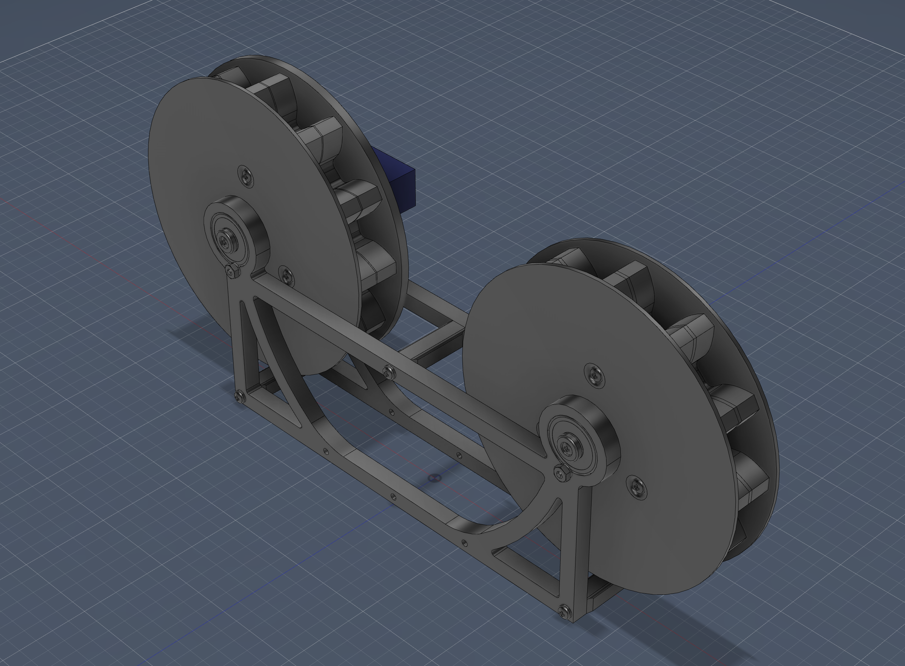

# Building Instructions

EmbRotary

As at March 29th, 2026

Note that the assembly for the fully-assembled base can be found in [`../Design/Base Assembly.f3z`](/Design/Base%20Assembly.f3z) and should be referred to when instructions are unclear.

## Parts
### Printed
Mesh files located in `/Print Files`
 - [`23mm-Connector_Wider.3mf`](/Start%20Building%20Here/PrintFiles/23mm-Connector.3mf) - Connector which goes between the two base frames (BaseServo and BaseBearings), 3 per base
 - [`AxleSpacer.3mf`](/Start%20Building%20Here/PrintFiles/AxleSpacer.3mf) - Placed between the bearing and pinion gear, 3 per base
 - [`BaseBearings.3mf`](/Start%20Building%20Here/PrintFiles/BaseBearings.3mf) - One of two base frames which holds only the ball bearings, 1 per base
 - [`BaseServo.3mf`](/Start%20Building%20Here/PrintFiles/BaseServo.3mf) - One of the two base frames which holds one ball bearing and one Feetech FT90R, 1 per base
 - [`BearingPlug.3mf`](/Start%20Building%20Here/PrintFiles/BearingPlug.3mf) - Acts as sleeve for M2 screw in ball bearing turning it into an axle, 3 per base
 - [`Pinion-Driver.3mf`](/Start%20Building%20Here/PrintFiles/Pinion-Driver.3mf) - The driver pinion gear which is driven by the servo horn, both halves included in this file, 1 per base
 - [`Pinion-Idler.3mf`](/Start%20Building%20Here/PrintFiles/Pinion-Idler.3mf) - The idler pinion gear which has one bearing on either side, both halves included in this file, 1 per base

 ### Hardware
 - `M2 Nut` - 16 per base
   - 1 per bearing
   - 2 per connector
   - 5 per idler pinion gear
   - 4 per driver pinion gear
 - `M2 Washer` - 6 per base
   - 2 per bearing (1 under screw head, 1 under nut)
 - `M2x8 Screw` - 3 per base
   - 1 per bearing
 - `M2x12 Screw` - 8 per base
   - 2 per connector
   - 2 per servo
 - `M2x16 Screw` - 9 per base
   - 1 per bearing
   - 3 per pinion gear
 - `625ZZ Bearing` - 3 per base
   - 2 per `BaseBearings.3mf`
   - 1 per `BaseServo.3mf`
 - `Feetech FT90R` - 1 per base
   - 1 per `BaseServo.3mf`

## Printing Parts

> All parts can be printed using PETG with:
> 15% infill,
> at least two perimeter shells,
> 4 top and bottom solid layers,
> 0.2 mm layer height for speed,
> brims for thin or small objects

1. Start by printing the base frames, both should be printed flat. The bearing-only base frame (`BaseBearings.3mf`) should not require any supports, unlike the servo base frame (`BaseServo.3mf`) which should be oriented such that the servo mounting point is floating above the printer bed to minimize the support material used.
2. Print the connectors (`23mm Connector_Wider.3mf`), three (or more) can be printed at a time. The connectors should be printed with the entry point for the M2 nuts facing up to remove the need for support materials.
3. You can now print the driver pinion gear (`Pinion-Driver.3mf`) and the idler pinion gear (`Pinion-Idler.3mf`), one after the other. Each `.3mf` file contains both halves on a single bed to reduce the need for printbed resets. With each half laying flange-side down on the printbed, supports should be enabled to reduce the risk of warped servo horn or M2 hardware interfacing surfaces.
4. Now the smaller parts comprising the pinion gear axles can be printed. Each bearing requires one `BearingPlug.3mf` and one `AxleSpacer.3mf`. The bearing plug holds and `M2x16 Screw` and goes into the bearing from the outside, exiting the bearing towards the pinion gear. Between the bearing and pinion gear, place a spacer to help align the two pinions and avoid interacting with other hardware such as the bearing mount screws. Testing shows each plug and spacer prints well alone, the ability to print multiple on a single bed depends on the individual printer's ability to handle multiple thin objects. The bearing plug should be placed on the bed with the fat side facing down and using both supports and a brim. The axle spacer should be placed flat and should also require a brim.

## Assembly
1. After printing the base frames, it's best to start by inserting the bearings. First, insert the bearings such that they are flush with the base frames. Next, take an `M2x8 Screw` and place an `M2 Washer` below the head before screwing it into the notch below the bearing from the pinion gear side of the frame. We screw in from the pinion gear side to minimize the protruding length since the exiting end which will go through the nut is longer than the head and washer. Once the threads begin to pop out from the other side of the frame, place another `M2 Washer` on the screw before screwing on an `M2 Nut`. Repeat two more times, each `BaseServo.3mf` requires one bearing and each `BaseBearings.3mf` requires two.
2. Next, we can attach the `Feetech FT90R` to our `BaseServo.3mf`. Be sure to remove any support material from the part, especially in the two pinion-facing surfaces of the servo mount itself, as those holes are cut to the shape of an `M2 Nut` to both make attachment easier and also better hold the fastened screw in place. First, it is much easier to attach the servo when the horn is uninstalled- so make sure the servo is free from any attachments. Next, it is easiest to screw the servo into the frame without trying to hold the nut in place. Insert the servo from the non-pinion side of the base frame. Insert two `M2x12 Screw` through the servo's mounting holes into the frame's holes and at least partially screw them in before trying to fasten them with the nuts. Then- hold the nut, one at a time, with your left index finger, while using the allen key to screw each `M2x12 Screw` through their respective `M2 Nut`. Once positively affixed, attach the servo horn by pressing it onto the servo's shaft as far as it will go before inserting and screwing in the small screw included with the servo along with its horns.
3. After the frames have been populated, we can prepare the connectors which will combine the two base frames into one base per assembly. For each `20mm Connector_Wider.3mf`, insert two `M2 Nut` into the bottom slots. Be careful with the orientation, as the internal cavity is designed so the longest dimension is vertical. That means the nut should not have one of it's flat faces parallel with the surface once it is fully seated.
4. Now we can connect the two base frames using the connectors. Hold each connector in place with your left hand, then insert an `M2x12 Screw` through the frame and screw it in until it goes through the frame and into the connector. It's easiest to do this one frame at a time.
5. After the bases have been screwed together and the pinion gears have been printed, we can prepare the pinion gears for assembly. 